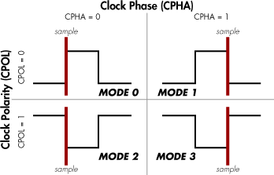

# SPI Communication Overview 🔄

**SPI** (Serial Peripheral Interface) is a synchronous serial communication protocol commonly used for short distance communication between microcontrollers and peripherals. It operates in **full-duplex mode** (simultaneous two way communication) and is generally faster than UART or I2C.

## Physical Connections

- **SCLK** (Serial Clock):

  - Clock signal generated by master
  - Synchronizes data transmission

- **MOSI** (Master Out Slave In):

  - Data line from master to slave
  - Carries commands/configurations

- **MISO** (Master In Slave Out):

  - Data line from slave to master
  - Typically carries sensor readings/responses

- **CS/SS** (Chip Select/Slave Select):
  - Master-controlled line to select slave
  - **Active low** (0 = selected)
  - One CS line per slave in basic setups

## Required Settings

1. **Clock Polarity (CPOL)**

   - Determines base clock state:
     - **CPOL=0**: Clock idles low (active high)
     - **CPOL=1**: Clock idles high (active low)

2. **Clock Phase (CPHA)**

   - Determines data sampling edge:
     - **CPHA=0**: Sample on **leading** clock edge
     - **CPHA=1**: Sample on **trailing** clock edge

3. **SPI Mode**

   

   - All devices must use same mode

4. **Data Frame Size**

   - Typically **8 bits** per transfer
   - Can be configured for other sizes (4-16 bits)

5. **Clock Speed**
   - Determined by master's capabilities

## Communication Process

1. **Slave Selection**

   - Master pulls target slave's **CS line low**

2. **Clock Generation**

   - Master generates SCLK signals

3. **Data Transmission**

   - **Full-duplex** transfer:
     - Master sends data through MOSI
     - Slave responds through MISO
   - Bits shifted:
     - Typically **MSB first** (configurable)
     - One bit per clock cycle

4. **Data Completion**
   - Master stops clock after required bits
   - Pulls CS line high to end session

## Communication Modes

1. **Single Slave**

   - Direct connection:
     - Master ↔ Single slave
     - Simplest configuration

2. **Independent Slaves**

   - Multiple slaves with separate CS lines
   - Shared SCLK/MOSI/MISO lines
   - Master selects one slave at a time via CS

3. **Daisy-Chained Slaves**
   - Single CS line for all slaves
   - Data propagates through slave chain:
     - Master → Slave1 → Slave2 → ... → Master

## Key Advantages

- **High speed**: Typically 10-100 Mbps
- **Full-duplex**: Simultaneous transmission
- **Simple hardware**: No address configuration
- **Flexible data sizes**: Not limited to 8-bit bytes

## Limitations

- **Pin count**: Requires 3+n wires (n = number of slaves)
- **No error checking**: No built-in acknowledgement
- **Short distance**: Best for board-level communication
- **Master dependency**: No slave-to-slave communication
